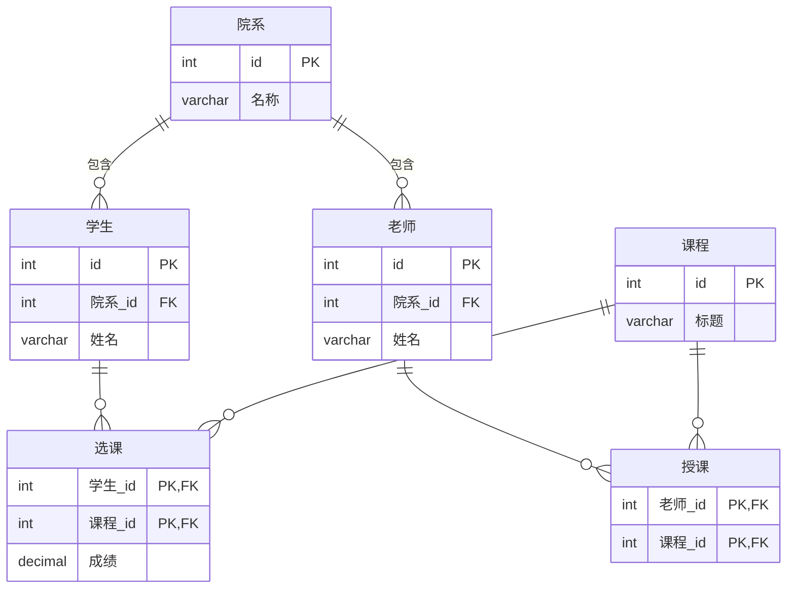
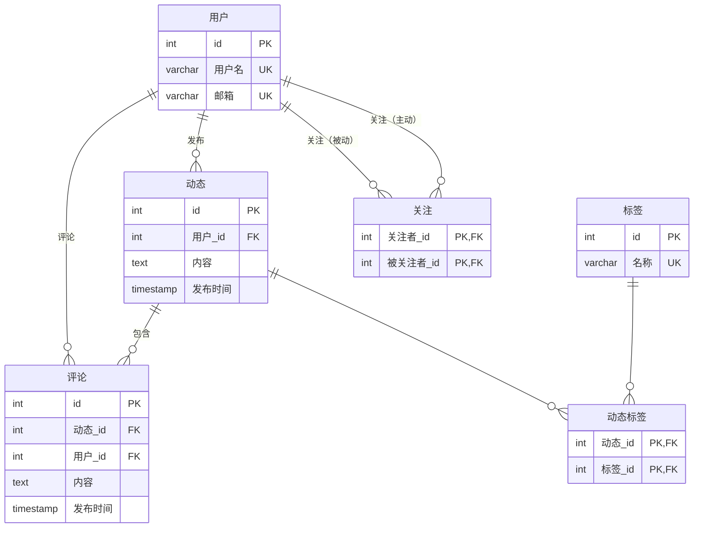
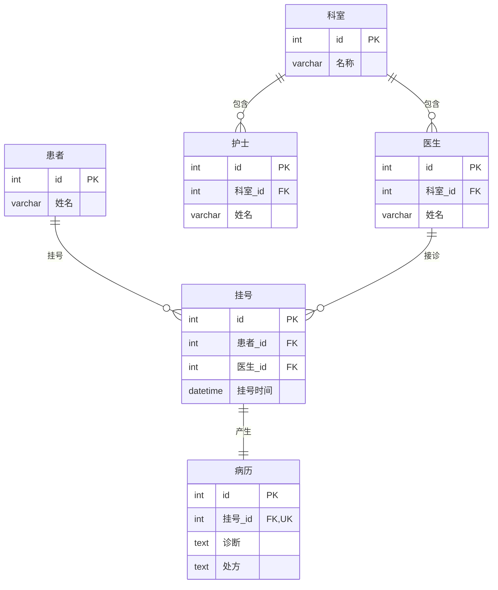
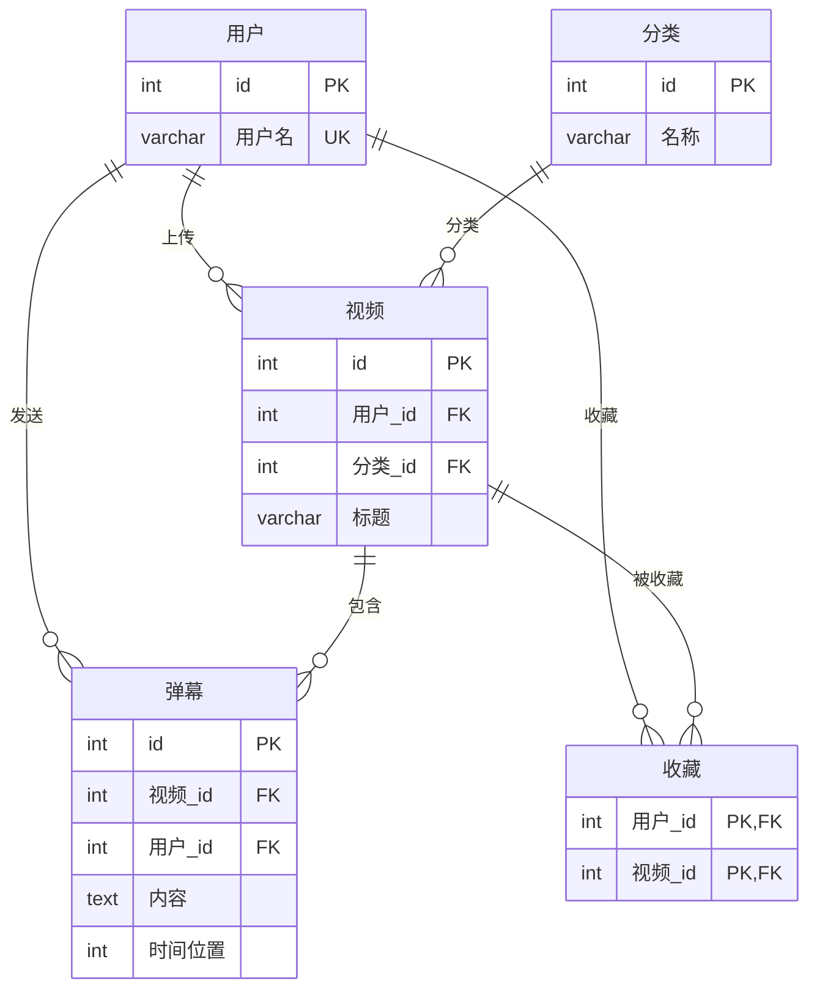

# 表关系判断

根据以下场景，分析需要设计哪些表，并说明表之间的关系（1:1、1:N、M:N）。

---

## 场景一：学校选课系统

一个学校有多个院系，每个院系有多个学生和多个老师。学生可以选修多门课程，一门课程可以被多个学生选修，选修后会记录成绩。每个老师只能属于一个院系，可以教授多门课程。

### ERD

### 表关系说明

| 关系 | 类型 | 说明 |
|------|------|------|
| `院系` → `学生` | 一对多（1:N） | 一个院系有多个学生 |
| `院系` → `老师` | 一对多（1:N） | 一个院系有多个老师 |
| `学生` ↔ `课程` | 多对多（M:N） | 通过 `选课` 中间表实现，记录成绩 |
| `老师` ↔ `课程` | 多对多（M:N） | 通过 `授课` 中间表实现 |

---

## 场景二：社交媒体平台

用户可以发布多条动态，每条动态可以有多个评论。用户可以关注其他用户，也可以被其他用户关注。每条动态可以有多个标签，一个标签也可以出现在多条动态中。

### ERD

### 表关系说明

| 关系 | 类型 | 说明 |
|------|------|------|
| `用户` → `动态` | 一对多（1:N） | 一个用户可以发布多条动态 |
| `用户` → `评论` | 一对多（1:N） | 一个用户可以发表多条评论 |
| `动态` → `评论` | 一对多（1:N） | 一条动态可以有多个评论 |
| `动态` ↔ `标签` | 多对多（M:N） | 通过 `动态标签` 中间表实现 |
| `用户` ↔ `用户` | 多对多（M:N） | 通过 `关注` 中间表实现，`关注者_id` 和 `被关注者_id` 都指向 `用户.id` |

---

## 场景三：医院挂号系统

一个医院有多个科室，每个科室有多名医生和多名护士。每个患者可以多次挂号，一次挂号只对应一个医生。一次挂号会产生一条就诊记录，一条就诊记录对应一份病历。

### ERD

### 表关系说明

| 关系 | 类型 | 说明 |
|------|------|------|
| `科室` → `医生` | 一对多（1:N） | 一个科室有多名医生 |
| `科室` → `护士` | 一对多（1:N） | 一个科室有多名护士 |
| `患者` → `挂号` | 一对多（1:N） | 一个患者可以多次挂号 |
| `医生` → `挂号` | 一对多（1:N） | 一个医生可以接诊多个患者 |
| `挂号` → `病历` | 一对一（1:1） | 一次挂号产生一条就诊记录，`挂号_id` 带 UNIQUE 约束 |

---

## 场景四：在线视频平台

用户可以上传多个视频，每个视频属于一个分类。用户可以收藏多个视频，一个视频可以被多个用户收藏。每个视频可以有多个弹幕，每条弹幕由某个用户发送。

### ERD

### 表关系说明

| 关系 | 类型 | 说明 |
|------|------|------|
| `用户` → `视频` | 一对多（1:N） | 一个用户可以上传多个视频 |
| `分类` → `视频` | 一对多（1:N） | 一个分类下有多个视频 |
| `用户` → `弹幕` | 一对多（1:N） | 一个用户可以发送多条弹幕 |
| `视频` → `弹幕` | 一对多（1:N） | 一个视频有多条弹幕 |
| `用户` ↔ `视频` | 多对多（M:N） | 通过 `收藏` 中间表实现用户收藏视频 |
