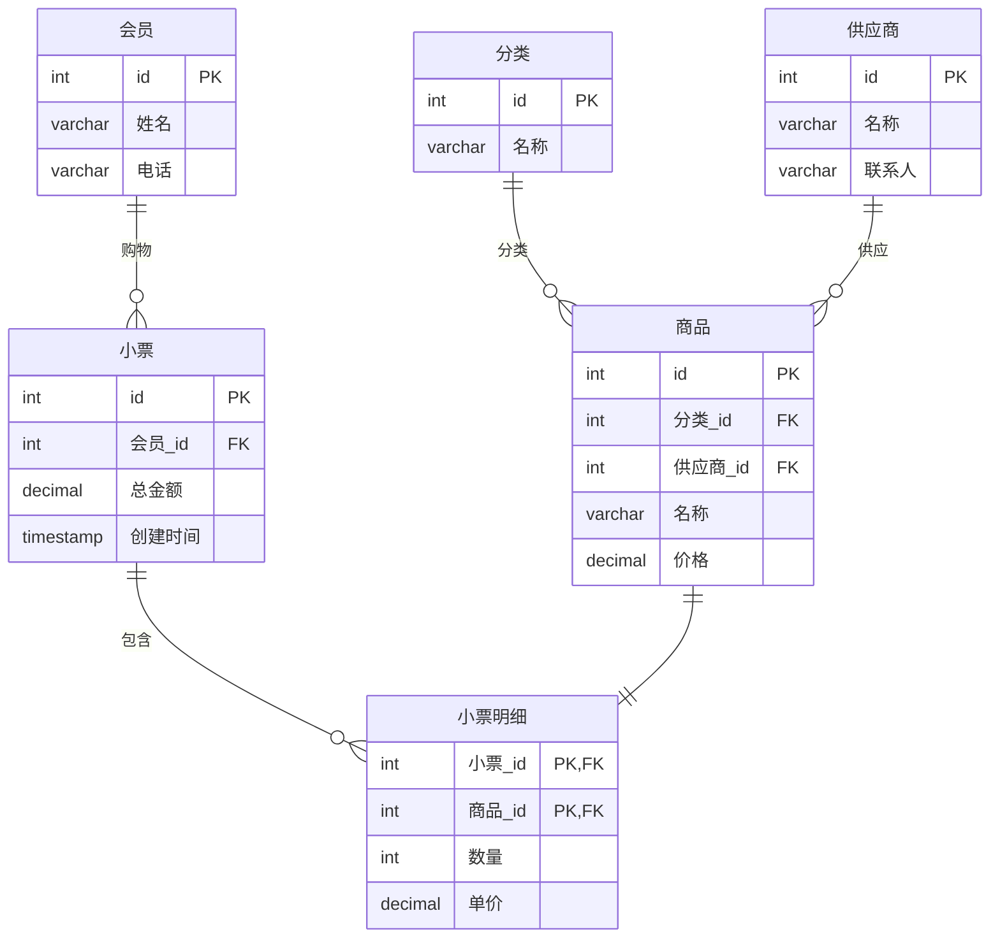
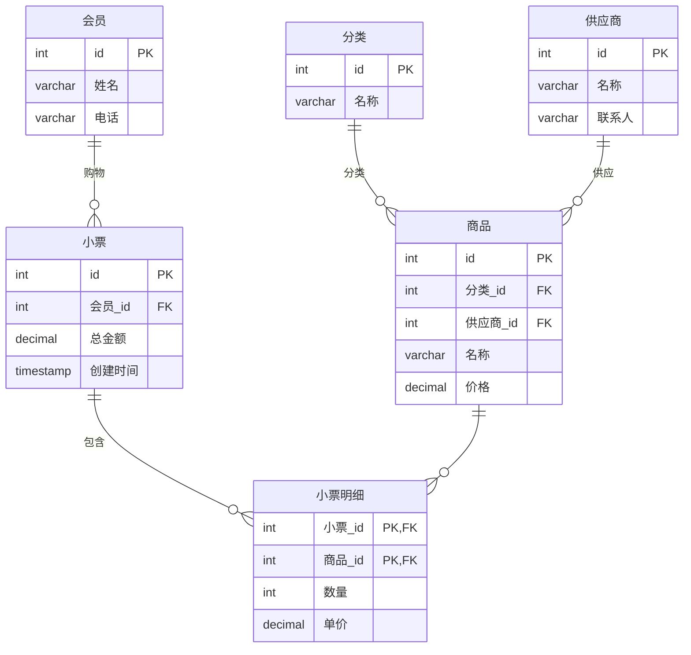

# 找茬题

## 题目

以下是一个**会员制超市收银系统**的 ER 图，其中**隐藏了一处错误的关系**。请找出这个错误，并说明应该怎么修正。

**场景描述**：会员每次购物会产生一张小票，小票上记录本次购物的多个商品及数量。每个商品属于一个分类。一个供应商可以供应多个商品，但每个商品只由一个供应商供应。

### 原 ERD（含错误）

---

## 答案

### 错误位置

`商品 ||--|| 小票明细` — **商品与明细之间的关系**标成了**一对一**。

### 错误原因

`商品`表是商品目录（如"牛奶"、"面包"），同一种商品可以被多次售卖，出现在不同小票的明细中。一对一关系意味着一个商品只能在一张小票中出现一次，之后就不能再被售卖，这显然不符合现实。

### 修正方案

将 `||--||`（一对一）改为 `||--o{`（一对多），即一个商品可以对应多条小票明细。同时，`小票明细` 中的 `商品_id` 不需要 UNIQUE 约束（联合主键已保证同一张小票中同种商品不重复）。

### 修正后的 ERD

